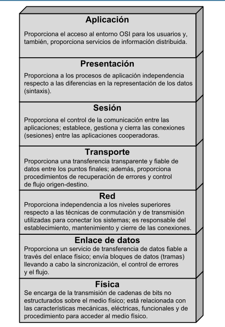
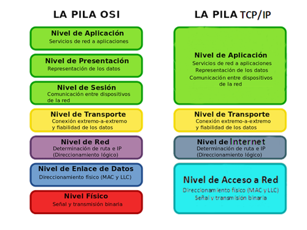

# Networking <!-- Metadata: type: Outline; tags: electronics,cool; created: 2020-06-28 15:15:37; reads: 2132; read: 2022-04-20 21:09:52; revision: 2132; modified: 2022-04-20 21:09:52; importance: 4/5; urgency: 0/5; progress: 54%; -->
Las redes son conjuntos de maquinas independientes conectadas mediante enlaces, utilizando una serie de reglas (protocolos) cuyo fin es compartir informacion.

 ## comandos utiles

revisar la configuracion de la interfaz fisica
```
ifconfig -a
```

revisar configuracion de la interfaz inalambrica
```
iwconfig
```
# Computacion en la nube <!-- Metadata: type: Note; created: 2020-11-25 17:49:19; reads: 7; read: 2022-04-20 20:48:19; revision: 2; modified: 2020-11-25 17:49:20; -->

# Fundaciones <!-- Metadata: type: Note; created: 2020-08-01 22:15:41; reads: 20; read: 2022-04-20 20:48:23; revision: 2; modified: 2020-08-01 22:15:42; -->

## IETF <!-- Metadata: type: Note; created: 2020-08-01 22:49:17; reads: 35; read: 2022-04-20 20:48:26; revision: 5; modified: 2020-08-12 18:29:47; -->
Internet Engineering Task Force

es una organizacion internacional abierta, su objetivo es contribuir al internet en todas las areas posibles, desde los bits hasta las aplicaciones, esta entidad es sin fines de lucro, ademas cualquier persona puede participar abiertamente.

 ## RFC
Request for comments

son publicaciones hechas por el IETF, describen el funcionamiento de internet y otras redes de computadores, estas publicaciones son de formato ASCII
## IANA <!-- Metadata: type: Note; created: 2020-08-01 22:19:30; reads: 42; read: 2022-04-20 20:48:29; revision: 5; modified: 2020-08-01 22:22:12; -->
Internet Assigned Numbers Authority

[sitio web](https://www.iana.org/)


es la coordinacion del root DNS, direccionamiento IP y otros recursos del protocolo internet.
### LACNIC <!-- Metadata: type: Note; created: 2020-08-03 10:59:36; reads: 28; read: 2022-04-20 20:48:29; revision: 5; modified: 2020-08-03 11:01:24; -->

es el registro de direcciones de america latina y caribe, es una organizacion no gubernamental internacional.


## ISOC <!-- Metadata: type: Note; created: 2020-08-01 22:15:33; reads: 36; read: 2022-04-20 20:48:29; revision: 12; modified: 2020-08-01 22:51:13; -->
Internet Society

[sitio web](https://www.internetsociety.org/es/)


es una organizacion sin fines de lucro fundada en 1992, esta se encarga de discutir asuntos respecto al futuro de internet, y **es el hogar de los grupos responsables de las normas de infraestructura de internet.**
# Modelo OSI <!-- Metadata: type: Note; created: 2020-06-28 16:07:48; reads: 167; read: 2022-04-20 20:53:59; revision: 77; modified: 2022-04-20 20:53:59; progress: 24%; -->
**Open System Interconnection**

El modelo OSI es una serie de capas de protocolos, cada una de estas "capas" realiza determinadas funciones con el fin de realizar un movimiento de informacion entre dos aplicaciones en maquinas diferentes y de manera segura.




 ## referencias
- [Windows Network Architecture and the OSI Model](https://docs.microsoft.com/en-us/windows-hardware/drivers/network/windows-network-architecture-and-the-osi-model)
- 
## LAN IEEE802 <!-- Metadata: type: Note; created: 2020-08-12 17:46:05; reads: 31; read: 2022-04-20 20:54:13; revision: 10; modified: 2020-08-12 18:13:56; -->
**Local Area Network** *aka*  **IEEE 802**  *aka* **ISO8002**

[Sitio web oficial](https://www.ieee802.org/)

es una familia de estandares que especifica la conexion en redes de area local (LAN's) y redes de area metropolitanas (MAN's)

- IEEE 802.3  CSMA/CD (**Ethernet**)
- IEEE 802.4 Token Bus
- IEEE 802.5 Token Ring

son alrededor de 24 protocolos que van desde el 802.1 hasta el 802.24, [aca en wikipedia](https://en.wikipedia.org/wiki/IEEE_802) hay una tabla bien chora con todos los protocolos culiaos.


## Hablemos de TCP/IP <!-- Metadata: type: Note; created: 2020-08-12 20:27:50; reads: 28; read: 2022-04-20 20:54:14; revision: 15; modified: 2020-10-27 17:49:13; -->
El modelo `TCP/IP` combina varias capas (4) de OSI en una sola:

- Application Layer
- Transport Layer
- Network Layer
- Link Layer




 # referencias: 
- [modelo de arquitectura del protocolo TCP/IP](https://docs.oracle.com/cd/E19957-01/820-2981/ipov-10/)

 ### protocolo IP
[RFC 791](https://tools.ietf.org/html/rfc791)
- [Clases de redes ip](http://alejollagua.blogspot.com/2012/12/direccion-ip-clase-b-c-d-y-e.html)


es parte del conjunto de protocolos TCP/IP y es el protocolo de interconexion de redes mas utilizado.

 #### servicios IP
se expresan en terminos de primitivas y parametros, la primitiva especifica la funcion a ofrecer mientras que el parametro se usa para pasar datos e informacion de control.

- primitiva send
    - dir. origen
- primitiva deliver

 #### Protocolo IP

la nomenclatura 192.168.1.1/27 el 27 significa que la submask tiene 27 "1"s, los tres primeros octetos suman 24, por lo tanto la subred usa 3 bits.

255.255.255.224, numero que en binario seria 1111 1111.1111 1111.1111 1111.1110 0000 (9 subredes).


## Formatos de informacion <!-- Metadata: type: Note; created: 2020-08-12 18:16:04; reads: 18; read: 2022-04-20 20:54:14; revision: 3; modified: 2020-08-12 18:17:53; -->
Mientras la informacion se mueve por la red, en alguna de las diferentes capas que especifica el estandar OSI, esta va mutando con el fin de adecuarse al canal y para asi asegurar mayor seguridad. Los nombres que toma la informacion son los siguientes:

-  Frame
- Packet
- Datagram
- Segment
- Message
- Cell
- Data unit
## Capa1 (PHYSICAL) <!-- Metadata: type: Note; created: 2020-07-08 16:17:26; reads: 72; read: 2022-04-20 20:59:46; revision: 7; modified: 2020-08-12 18:19:18; -->
especifica las señales electricas (encodificacion) y niveles de voltaje, ademas define las caracteristicas de varios conectores que se usan para estos propositos

 existen 3 medios tipicos, por los cuales circula la informacion:

- Cable de cobre
- Fibra optica
- Inalambrico


### Interfaz de red <!-- Metadata: type: Note; created: 2020-07-19 09:44:11; reads: 58; read: 2022-04-20 20:59:47; revision: 5; modified: 2022-04-20 20:56:05; -->
la interfaz es el dispositivo mediante el cual una maquina se comunica con otra maquina utilizando señales que pueden ser electricas, opticas o electromagneticas en el caso de las radiofrecuencias, a continuacion se muestra el esquematico de una interfaz generica basada en el [RTL8019AS](http://www.ethernut.de/pdf/8019asds.pdf):


- gentileza de [bitscope](http://www.bitscope.org/net/?p=adaptor)
### RS 232-C <!-- Metadata: type: Note; created: 2020-08-12 18:19:43; reads: 25; read: 2022-04-20 20:59:46; revision: 4; modified: 2020-08-12 18:19:55; -->

### DB 25 <!-- Metadata: type: Note; created: 2020-08-12 18:20:04; reads: 20; read: 2022-04-20 20:59:46; revision: 2; modified: 2020-08-12 18:20:06; -->

### DB 9 <!-- Metadata: type: Note; created: 2020-08-12 18:20:11; reads: 22; read: 2022-04-20 20:59:46; revision: 2; modified: 2020-08-12 18:20:13; -->

### Hub y Repeaters <!-- Metadata: type: Note; created: 2020-07-08 16:17:36; reads: 90; read: 2022-04-20 20:59:45; revision: 23; modified: 2022-04-20 20:59:45; -->
 ## Hub (Concentrador)


es un dispositivo que permite centralizar un cableado, puede ser cualquier tipo de cableado (serial, coaxial), el dispositivo toma la señal de entrada y la repite por todos sus puertos.

 ## Repeater


se utilizan para extender el alcance de un dominio de colisiones, hoy en dia se utilizan principalmente para redes inalambricas y buses de larga distancia.
### Ethernet <!-- Metadata: type: Note; created: 2020-07-19 09:42:43; reads: 38; read: 2022-04-20 20:58:58; revision: 4; modified: 2020-07-19 09:42:48; -->

## Capa2 (DATA LINK) <!-- Metadata: type: Note; created: 2020-07-08 16:06:06; reads: 110; read: 2022-04-20 20:54:14; revision: 15; modified: 2020-10-24 16:55:10; -->
se encarga de la transferencia fiable de data entre vecinos cercanos (Ruteo LAN), para este fin emplea un circuito de transmision de datos, esto se realiza mediante *codigos de redundancia ciclica*

tambien evita la inundacion de la red (sincronismo), recordar que esto se produce por la diferencia de clock entre la CPU de origen y destino.


### Switch <!-- Metadata: type: Note; created: 2020-07-08 15:05:51; reads: 190; read: 2022-04-20 21:00:35; revision: 72; modified: 2022-04-20 21:00:35; -->
estos dispositivos se utilizan para realizar un direccionamiento fisico de la data.


 <!-- Metadata: type: Note; created: 2020-11-07 22:24:58; reads: 1; read: 2020-11-07 22:24:58; revision: 1; modified: 2020-11-07 22:24:58; --> <!-- Metadata: type: Note; created: 2020-11-25 17:49:20; reads: 1; read: 2020-11-25 17:49:20; revision: 1; modified: 2020-11-25 17:49:20; --> <!-- Metadata: type: Note; created: 2021-01-17 11:33:37; reads: 1; read: 2021-01-17 11:33:37; revision: 1; modified: 2021-01-17 11:33:37; --> <!-- Metadata: type: Note; created: 2021-02-13 16:40:23; reads: 1; read: 2021-02-13 16:40:23; revision: 1; modified: 2021-02-13 16:40:23; --> <!-- Metadata: type: Note; created: 2021-02-13 20:31:21; reads: 8; read: 2022-04-20 21:03:07; revision: 2; modified: 2022-04-20 21:03:07; -->
-------------------------------------------------------------------------------------------------------------------------------------------------------------------------------------------------------------------------------------------------------------------------------------------------------------------------------------------------------------------------------------------------------------------------------------------------------------------------------------------------------------------------------------------------------------------------------------------------------------------------------------------------------------------------
 ## Manejo de direcciones MAC (direccionamiento fisico)
varios protocolos utilizan metodos para conocer las direcciones MAC que hay conectadas a un dispositivo, algunos ejemplos:
- ARP
- Hello Protocol
- Direccion MAC predecible


 ## Resolucion de direcciones MAC


para que los dispositivos se puedan comunicar primero necesitan compartir un medio fisico, seguido de esto la comunicacion se realiza de la siguiente forma:

*Maquina de origen(MO) quiere comunicarse con maquina de destino(MD)*
1. MO realiza broadcast preguntando por MD
2. MD responde enviando su direccion MAC

- El broadcast es un mensaje con direcion MAC de destino FF.FF.FF.FF.FF.FF, por lo cual lo recepcionan todos los usuarios de un mismo *dominio de colisiones*. Esto se conoce como [protocolo ARP](./Networking)


 ## Dominio de colisiones (colision domain)


se entiende por dominio de colisiones a un segmento fisico de la red donde las tramas pueden colisionarse con otros, esto hace que disminuya el rendimiento de la red.

$$Rendimiento = (1 - \frac{Colisiones}{Paquetes\ Totales})*100 $$

 #### Algunas consideraciones:
- un dominio de colision puede ser un segmento de cable ethernet
- Los dispositivos de capa 1 (Hub y Repeaters) extienden los dominios de colisiones
- Los dispositivos de capa 2 (Switch) dividen los dominios de colisiones como se ve en la figura superior
- Los dispositivos de capa 3 dividen los dominios de colision y ademas *los dominios de broadcast*

 ## Dominio de difusion (broadcast domain)
es un area logica de la red sobre la cual cualquier maquina puede comunicarse sin pasar por ningun router.

#### VLAN <!-- Metadata: type: Note; created: 2020-07-12 17:19:41; reads: 112; read: 2022-04-20 21:05:20; revision: 18; modified: 2022-04-20 21:05:20; -->
 ## Virtual local area network 
es un metodo para crear redes logicas dentro de una misma red fisica. Varias VLAN pueden coexistir en un switch

Para configurar VLAN's en un switch CISCO realizamos el siguiente algoritmo:
```
# definir la VLAN
vlan <N°>
name <Nombre de la VLAN>
# asignar los puertos a las VLAN
interface <interface tipo y numero>
switchport access <VLAN N°>
```

para revisar las VLAN existentes en un switch podemos utilizar el siguiente comando:
```
Switch#show vlan
```

 ## ejemplo realizado en clases:
en la siguiente figura se muestra la red estudiada en clases


para configurar las VLAN's primero declaramos cada una de las redes virtuales y les damos un nombre:
```
Switch(config)#vlan 10
Switch(config-vlan)#name electrica
Switch(config-vlan)#exit
Switch(config)#vlan 11
Switch(config-vlan)#name medicina
Switch(config-vlan)#exit
Switch(config)#vlan 12
Switch(config-vlan)#name telematica
```
ahora procedemos a configurar los puertos del switch que perteneceran a cada numero de VLAN:
```
Switch(config)#interface FastEthernet0/1
Switch(config-if)#switchport access vlan 10
Switch(config-if)#exit
Switch(config)#interface FastEthernet5/1
Switch(config-if)#switchport access vlan 10
Switch(config-if)#exit
Switch(config)#interface FastEthernet1/1
Switch(config-if)#switchport access vlan 11
Switch(config-if)#exit
Switch(config)#interface FastEthernet4/1
Switch(config-if)#switchport access vlan 11
Switch(config-if)#exit
Switch(config)#interface FastEthernet2/1
Switch(config-if)#switchport access vlan 12
Switch(config-if)#exit
Switch(config)#interface FastEthernet3/1
Switch(config-if)#switchport access vlan 12
Switch(config-if)#exit
```

#### Trunk <!-- Metadata: type: Note; created: 2020-07-13 09:54:02; reads: 82; read: 2022-04-20 21:06:07; revision: 24; modified: 2022-04-20 21:06:07; -->
el protocolo IEEE802.1Q mas conocido como *dot1Q* permite usar un cable entre switch marcando cada frame con el N° ID de cada VLN.

para habilitar el trunk se debe realizar la siguiente configuracion:
```
switch(config)# interface <nombre_interfaz>
switch(config-if)# switchport mode trunk
```

 ## formato de la trama
esto se realiza mediante el protocolo 802.1Q, se agrega una cabecera de 4 Byte al encabezado de cada frame ethernet.


 ## ejemplo usando packet tracer


La configuracion de VLAN del switch0 es identica a la realizada en el ejemplo de vlan, bien se podria hacer un copy paste. la configuracion del trunk se realiza en la interfaz que une ambos switch como se muestra a continuacion:
```
Switch(config)#interface fastethernet9/1
Switch(config-if)#switchport mode trunk
```
**lo mismo corre para ambos switch.**
#### Router on a stick <!-- Metadata: type: Note; created: 2020-07-15 21:12:19; reads: 108; read: 2022-04-20 21:07:12; revision: 56; modified: 2022-04-20 21:07:12; -->
mediante este metodo es posible conectar dos VLAN's que se encuentren separadas por un dispositivo de capa 3 en internet. esto es posible mediante el uso de un *troncal*


 ## configuracion del switch

aca configuramos las VLAN normalmente y habilitamos TRUNK en la interfaz que conecta el switch con el router como se muestra a continuacion:
```
# switch 0
# VLAN 10
Switch(config)#vlan 10
Switch(config-vlan)#name electrica
Switch(config)#interface fastethernet0/1
Switch(config-if)#switchport access vlan 10
Switch(config-if)#exit
Switch(config)#interface fastethernet3/1
Switch(config-if)#switchport access vlan 10
Switch(config-if)#exit
# VLAN 11
Switch(config)#vlan 11
Switch(config-vlan)#name medicina
Switch(config)#interface fastethernet 1/1
Switch(config-if)#switchport access vlan 11
Switch(config)#interface fastethernet 2/1
Switch(config-if)#switchport access vlan 11

Switch(config-if)#exit
Switch(config)#interface fastethernet 4/1
Switch(config-if)#switchport access vlan 11
Switch(config-if)#exit
# TRUNK
Switch(config)#interface fastethernet 9/1
Switch(config-if)#switchport mode trunk
# switch0(1)

# VLAN 10
Switch(config)#vlan 10
Switch(config-vlan)#name electrica
Switch(config)#interface fastethernet0/1
Switch(config-if)#switchport access vlan 10
Switch(config-if)#exit
Switch(config)#interface fastethernet3/1
Switch(config-if)#switchport access vlan 10
Switch(config-if)#exit

# VLAN 11
Switch(config)#vlan 11
Switch(config-vlan)#name medicina
Switch(config)#interface fastethernet 1/1
Switch(config-if)#switchport access vlan 11
Switch(config)#interface fastethernet 2/1
Switch(config-if)#switchport access vlan 11

# TRUNK
Switch(config)#interface fastethernet 9/1
Switch(config-if)#switchport mode trunk
```
 ## configuracion del router
Para comunicar ambos sistemas autonomos primero se establece protocolo [BGP](./Networking.md#OSI#capa2) entre ambos router
```
# router 0
Router(config)#router bgp 64495
Router(config-router)#network 200.200.200.0 mask 255.255.255.128
Router(config-router)#network 200.200.201.0 mask 255.255.255.128
Router(config-router)#neighbor 192.168.1.253 remote-as 64496
# router 1
Router(config-router)#network 200.200.200.128 mask 255.255.255.128
Router(config-router)#network 200.200.201.128 mask 255.255.255.128
Router(config-router)#neighbor 192.168.1.254 remote-as 64495


```

la siguiente configuracion es para el protocolo dot1Q
```
# Router 0
Router(config)#interface fastethernet 0/0.10
Router(config-subif)#encapsulation dot1q 10
Router(config-subif)#ip address 200.200.200.126 255.255.255.128
Router(config-subif)#exit
Router(config)#interface fastethernet 0/0.11
Router(config-subif)#encapsulation dot1q 11
Router(config-subif)#ip address 200.200.201.126 255.255.255.128


# Router 1
Router(config)#interface fastethernet 0/0.10
Router(config-subif)#encapsulation dot1q 10
ip address 200.200.200.254 255.255.255.128
Router(config-subif)#exit
Router(config)#interface fastethernet 0/0.11
Router(config-subif)#encapsulation dot1q 11
ip address 200.200.201.254 255.255.255.128
```

### ARP <!-- Metadata: type: Note; created: 2020-07-08 16:06:46; reads: 96; read: 2022-04-20 21:09:52; revision: 17; modified: 2022-04-20 21:09:52; -->
 ## Address resolution protocol
- [RFC 826](https://tools.ietf.org/html/rfc826)
- [RFC 6747](https://tools.ietf.org/html/rfc6747)


*nota: este protocolo podria pertenecer a capa 3 dependiendo del contexto.

es el responsable de encontrar la direccion fisica (ethernet MAC) que corresponde a una determinada IP, el mecanismo para realizar esto es el broadcast (enviar a todos los equipos de la red)

- La MAC del broadcast es FF.FF.FF.FF.FF.FF

se puede revisar las tablas ARP en una maquina ingresando el siguiente comando
```
arp -a
```
el inverso de este protocolo se conoce cono RARP (reverse address resolution protocol) y esta especificado en el [RFC 903](https://tools.ietf.org/html/rfc903).

ARP se utiliza en cuatro casos distintos:

- dos hosts estan en la misma red y uno quiere enviar paquetes a otro
- dos hosts estan en redes diferentes y deben usar un gateway o router para comunicarse
- un router necesita enviar paquetes a un host mediante otro router
- un router necesita enviar paquetes a un host de la misma red


## Capa3 (NETWORK) <!-- Metadata: type: Note; created: 2020-07-08 16:16:21; reads: 131; read: 2022-04-20 20:54:14; revision: 18; modified: 2020-08-12 20:28:04; -->
Capa encargada de proveer ruteo `source-path`, es decir se encarga del enrutamiento, aca se define el conjunto de reglas utilizadas por los routers cuando se comunican entre si para compartir informacion pertinente al ruteo.

### Tcl <!-- Metadata: type: Note; created: 2020-09-05 12:16:50; reads: 14; read: 2022-04-20 20:54:14; revision: 4; modified: 2020-09-05 12:18:32; -->
**Tool command Language**


para habilitar en un router se debe ejecutar `tclsh` en una terminal.
### Routers <!-- Metadata: type: Note; created: 2020-06-28 16:05:31; reads: 199; read: 2022-04-20 20:54:14; revision: 58; modified: 2020-09-05 12:16:37; progress: 24%; -->
Este dispositivo esta encargado del direccionamiento logico de data.


### NAT <!-- Metadata: type: Note; created: 2020-07-30 17:43:49; reads: 50; read: 2022-04-20 20:54:14; revision: 9; modified: 2020-08-25 21:37:12; -->
Network Address translation

esta configuracion se realiza en el router, sirve para esconder una direccion ip en una red privada de la internet. Esto se realiza tanto cuando salen los paquetes, como cuando entran.


</img>

incluye cuatro tipos de direcciones
- direccion local interna
- direccion global interna
- direccion local externa
- direccion global externa

[FAQ de NAT en la pag de cisco](https://www.cisco.com/c/en/us/support/docs/ip/network-address-translation-nat/26704-nat-faq-00.html)
### comandos CISCO <!-- Metadata: type: Note; created: 2020-07-08 20:19:52; reads: 73; read: 2022-04-20 20:54:14; revision: 26; modified: 2020-09-05 17:18:15; -->
 ## modo root

para poder ser root usamos el comando:
```
router> enable
```
pero tambien solo basta con `en`
```
router> en
```
**insert nobunaga picture here**

ahora nuestro prompt ha cambiado a `router#` y podremos acceder a las configuraciones intimas de nuestro router.

 #### tablas de ruteo:
```
router# show ip route
```

 #### configuracion actual en la RAM del router:
```
router# show running-config
```

 #### Mostrar protocolos:
```
router# show ip protocols
```

 ### Mostrar informacion de algun protocolo especifico
```
router# show ip bgp
```

 #### chequear hardware y software del router
```
router# show version
```

 #### revisar los ultimos 10 comandos del buffer de comandos del router 
especial para encontrar pillines
```
router# show history
```

 #### usar la terminal sin guardar en el historial de comandos:
para ser un pillo
```
router# terminal no history
```


una vez en modo root tambien podemos configurar la terminal escribiendo el siguiente comando:


 ### modo config
en este modo es posible cambiar las configuraciones del router, para ingresar se hace de la siguiente manera:
```
router# config T
router(config)#
```
tambien vale la abreviacion `conf t`

- `hostname NOMBREDELROUTER` cambia el nombre de host de nuestro router.

 ### configurar alguna interfaz
para configurar alguna interfaz, primero debemos estar en el prompt de configuracion `router(config)#`, y seleccionamos una interfaz de la siguiente forma:
```
router(config)# interface NOMBRE_INTERFAZ
```
- `shutdown` apaga la interfaz
- `no shutdown` enciende la interfaz
- `ip address <direccion ip> <mascara subred>` configura nuestra ip y mascara de subred

Para configurar una interfaz te dejo el siguiente matute, para que veas lo facil que es abreviar comandos en cisco systems:
```
Router>en
Router#conf t
Router(config)#hostname R3
R3(config)#int fastethernet0/0
R3(config-if)#ip add 200.200.2.2 255.255.255.0
R3(config-if)#no sh
```

 # restaurar configuracion inicial

para hacerlo debemos estar en terminal root y correr los siguientes comandos:
```
router> enable
router# write erase
router# reload
```

el asistente de configuracion inicial es opcional y poco util vs el abanico de comandos presentados.
### Sistema Autonomo <!-- Metadata: type: Note; created: 2020-07-12 16:16:21; reads: 66; read: 2022-04-20 20:54:14; revision: 4; modified: 2020-07-19 10:57:33; -->

### Protocolos internos (IGP) <!-- Metadata: type: Note; created: 2020-07-12 16:11:39; reads: 48; read: 2022-04-20 20:54:14; revision: 7; modified: 2020-08-12 20:22:54; -->
estos protocolos se utilizan para el intercambio de informacion **dentro de un sistema autonomo**.
#### ICMP <!-- Metadata: type: Note; created: 2020-07-08 16:20:07; reads: 101; read: 2022-04-20 20:54:14; revision: 32; modified: 2020-08-16 00:03:06; -->
Internet control message protocol

- Protocolo original [RFC 792](https://tools.ietf.org/html/rfc792)
- Version IPv6 [RFC 4443](https://tools.ietf.org/html/rfc4443)

Es un protocolo de reporte de errores, se utiliza para control y diagnostico generalmente, cualquier dispositivo de red tiene la habilidad de enviar, recibir y procesar mensajes de ICMP.

- **ICMP no es un protocolo de transporte de data**


- puede controlar si el paquete no alcanza su destino,
- si ha cumplido su TTL
- el encabezado lleva un valor no permitido
- regula si el paquete es un eco o respuesta.
- tanto `ping` como `traceroute` utilizan ICMP

 ## mensajes informativos:
el campo de *Code* en el protocolo especifica el mensaje ICMP(Major code), para cada mensaje existe un submensaje (Minor code):


 ## Frame


- tiene un header de 8 Byte (Type, code, fcs, ID, sequence)
- Cada frame ICMP contiene dentro el header del frame IP del mensaje original, de esa forma el sistema que recepciona sabe cual paquete fallo, en caso de ocurrir este.

 #### referencias
- [definicion de ICMP](https://searchnetworking.techtarget.com/definition/ICMP)
- [what is and how does it work ICMP](https://www.ionos.com/digitalguide/server/know-how/what-is-icmp-protocol-and-how-does-it-work/)
#### OSPF <!-- Metadata: type: Note; created: 2020-07-08 16:20:32; reads: 97; read: 2022-04-20 20:54:14; revision: 41; modified: 2020-09-05 17:10:28; -->
Open Shortest Path First

- version 1 [RFC]
- version 2 [RCF 2328](https://tools.ietf.org/html/rfc2328)
- Version IPv6 [RCF 5340](https://www.ietf.org/rfc/rfc5340.txt)
- algoritmo dijkstra [RFC 1247]()

Fue Desarrollado por el IETF, es un protocolo jerarquico que opera dentro de un sistema autonomo (se usa para separar SA's). 
- sus aplicaciones incluyen: `enterprise networks` AKA `intranet`, utiliza el `algoritmo de Dijkstra`, es un protocolo `sin clase`
- los router de borde...
- las metricas...
- costo administrativo ...
- la autenticacion se realiza mediante Plain y MD5

 #### OSPF rutina:
1. Se envia un mensaje de HELLO por cada una de las interfaces
2. Si se recibe un `HELLO`, se envia un `Acknowledgement`, el cual puede ser en texto plano, o en MD5
3. generar el LSDB
4. Intercambio de LSDB entre routers vecinos
5. Cada router realiza SPF (dijkstra)

El mensaje `HELLO` se envia por multicast usando la direccion ip `224.0.0.5`, esta red es la red de `MULTICAST`, y se envia cada 10 segundos.

 ## terminologia de area
- ABR(Area Border Router): son los que unen dos areas
- ASBR: Es el borde de un sistema autonomo, tambien son aquellos que unen redes OSPF con redes no OSPF.
- Backbone Router
- Internal Router
- External Router

 ## Algoritmo de Dijkstra


 ## Frame


bajo todo lo que vemos en la imagen, va la data, de largo variable.

 ## Estructura de datos

dentro del router OSPF funciona como una base de datos, separada en 3:
- base de datos de adyacencia: tabla de vecinos
- base de datos de estado de enlace (LSBD): tabla de topologia
- base de datos de reenvio: tabla de ruteo, estas son intercambiadas con los vecinos

las bases antes mencionadas las podemos revisar utilizando los siguientes comandos:
```
# base de datos de adyacencia
show ip ospf neighbor
# base de datos de estado de enlace
show ip ospf database
# base de datos de reenvio
show ip route
``` 

 ## Configuracion en cisco

para habilitar ospf primero debemos asignar un `OSPF router ID`, sino se genera automaticamente, este numero es de 32 bits y va en el primer campo del frame, luego iniciamos el proceso OSPF en el router.
```
router(config)# router ospf id-del-proceso
router(config-router)#
```
luego podemos habilitar los paquetes ospf en alguna interfaz cualquiera del router
```
router(config-router)# network direccion-ip mascara-wildcard codigo-de-area
```

Para revisar las tablas de osp en un router ensayar lo siguiente:
```
router# show ip ospf database
```


 ## Ejemplos
en el laboratorio 2 se realizo esta configuracion de `OSPF` en los routers del backbone central:
```
Router#conf t
Router(config)#router ospf 15
Router(config-router)#network 200.200.200.0 0.0.0.127 area 0
```

 #### Referencias
[CISCO troubleshooting](https://www.certificationkits.com/cisco-certification/cisco-ccnp-tshoot-642-832-exam-study-center/cisco-ccnp-tshoot-ospf/)
#### EIGRP <!-- Metadata: type: Note; created: 2020-07-08 16:19:09; reads: 64; read: 2022-04-20 20:54:15; revision: 9; modified: 2020-07-12 16:12:04; -->
 ## Enhanced interior gateway routing protocol / sin clase
[RFC 7868](https://tools.ietf.org/html/rfc7868)
su sigla significa Enhanced interior gateway routing protocol, propiedad de CISCO, es mas facil de configurar que OSPF

maneja tres tablas:
- tabla de vecinos
- tabla de topologia
- tabla de enrutamiento

para habilitarlo en un router abrimos la terminal e ingresamos la configuracion de EIGRP:
```
router(config)# router eigrp 10
router(config algo)# network <subred ip> <wildcard>
```

*mascara wildcard: es una mascara que indica las partes de un numero ip que son relevantes para una determinada accion*
### Protocolos externos (EGP) <!-- Metadata: type: Note; created: 2020-07-12 16:11:56; reads: 45; read: 2022-04-20 20:54:15; revision: 6; modified: 2020-08-12 20:22:56; -->
Son protocolos de ruteo usados para intercambiar informacion **entre sistemas autonomos**
#### BGP <!-- Metadata: type: Note; created: 2020-07-12 16:10:04; reads: 69; read: 2022-04-20 20:54:15; revision: 24; modified: 2020-07-19 11:46:44; -->
 ## border gateway protocol
[RFC]()


mediante este protocolo se intercambian las tablas de ruteo entre sistemas autonomos.

existen dos tipos de BGP: iBGP y eBGP, lo cual hace distincion si es dentro de un AS o fuera del AS, se realiza una conexion TCP entre vecinos, no necesariamente deben estar a distancia uno.


 ## Sistemas autonomos


un SA es un conjunto de reded IP que posee una politica de ruteo propio e independiente, se identifican utilizando un numero (ASN) el cual es asignado por [IANA]() y cuyo largo es de 16 o 32 bits. La asignacion es de la siguiente forma:


 ## configuracion en router CISCO

primero se crea un proceso BGP en el router
```
router bgp <ASZ>
```
luego definimos los peers:
```
neighbor <IP> remote-as <AS-remoto>
```

por ultimo se define la redes que seran anunciadas en BGP:


```
network <IP-network> mask <MASCARA-IP>
```

 # ejemplo de red BGP

en el router0 ingresamos los siguientes comandos:
```
Router(config)#router bgp 100
Router(config-router)#neighbor 200.200.200.126 remote-as 200
Router(config-router)#network 200.200.200.0 mask 255.255.255.224
```

luego en el router central (router1)
```
Router(config)#router bgp 200
Router(config-router)#network 200.200.200.32 mask 255.255.255.224
Router(config-router)#network 200.200.200.96 mask 255.255.255.224
Router(config-router)#network 200.200.200.128 mask 255.255.255.224
Router(config-router)#neighbor 200.200.200.97 remote-as 100
Router(config-router)#neighbor 200.200.200.158 remote-as 300


```

por ultimo configuramos el router de la derecha (router2)
```
Router(config)#router bgp 300
Router(config-router)#network 200.200.200.64 mask 255.255.255.224
Router(config-router)#neighbor 200.200.200.119 remote-as 200
Router(config-router)#%BGP-5-ADJCHANGE: neighbor 200.200.200.129 Up
```

la red utilizada en paquet tracer es la siguiente:


## Capa4 (TRANSPORT) <!-- Metadata: type: Note; created: 2020-07-08 16:17:01; reads: 79; read: 2022-04-20 20:54:15; revision: 19; modified: 2020-07-13 12:14:43; -->


Implementa los servicios de transporte de datos confiable entre origen-destino, sus principales funciones son:
- control de flujo (que los paquetes lleguen en orden)
- multiplexion
- chequeo de errores

aqui se realiza direccionamiento de puertos, para revisar los puertos de una maquina (en windows y unix) utilizamos el comando `netstat`

### UDP <!-- Metadata: type: Note; created: 2020-07-08 16:58:23; reads: 58; read: 2022-04-20 20:54:15; revision: 8; modified: 2020-07-23 16:56:08; -->
 ## User datagram protocol

[RFC 768]()

se utiliza por lo general cuando se requiera rapidez a traves de la RED, como video o audio en vivo.

es un protocolo no orientado a la conexion, utliliza pocos recursos, sus aplicaciones son:

- DNS
- Streaming de video
- Voz sobre IP (VoIP)
### TCP <!-- Metadata: type: Note; created: 2020-07-08 16:58:05; reads: 77; read: 2022-04-20 20:54:15; revision: 11; modified: 2020-07-13 12:14:01; -->
 ## Transmission control protocol

[RFC 793]()

es un protocolo orientado a la conexion, utiliza el protocolo de *ventana deslizante*, sus principales funciones son:
- exploradores web
- email
- transferencia de archivos

## Capa5(SESSION) <!-- Metadata: type: Note; created: 2020-08-01 21:52:34; reads: 30; read: 2022-04-20 20:54:15; revision: 3; modified: 2020-08-01 21:52:39; -->

## Capa6 & Capa7 (PRESENTATION & APPLICATION) <!-- Metadata: type: Note; created: 2020-08-01 21:53:21; reads: 33; read: 2022-04-20 20:54:15; revision: 5; modified: 2020-08-12 18:26:47; -->


 # 
 ### protocolo HTTP

 ### protocolo SSH

 ### protocolo telnet

 ### protocolo FTP
### DNS <!-- Metadata: type: Note; created: 2020-07-23 16:58:08; reads: 97; read: 2022-04-20 20:54:15; revision: 39; modified: 2020-08-25 21:37:22; -->
Domain Name System


este sistema nace de la necesidad de nombrar los numeros ip's. Se guarda en el archivo hosts, su ruta en windows es `C:\USER\WINDOWS\SYSTEM32\DRIVERS\ETC\HOSTS`, su equivalente en linux es el resolv.conf.

- [DNS checker](https://dnschecker.org/)
- [resolv.conf](http://fpg.66ghz.com/DebianRed/dns__etcresolvconf.html?i=1)
- [DNS publico de google](https://es.wikipedia.org/wiki/Google_Public_DNS)

 #### resolver
los clientes se llaman `resolver` , pasan los requerimientos de nombre a los `nameservers`

se pueden hacer tres tipos de consultas(para resolver nombres):
1. **Recursiva:** el server es obligado a responder la peticion
2. **Iterativa:** el server puede resolver el nombre o referirlo a otro nameserver para que lo resuelva en caso de que no se la pueda
3. ***Inversa:** 

 #### nameservers
los server toman el nombre de nameservers, procesan un  requerimiento (www.algo.com) y resuelven el nombre en numero IP


 ## Zonas de autoridad
corresponde al espacio en el cual un `nameserver` es responsable de resolver nombres.

 #### jerarquia


 ## Address Record (A record)
son una forma sencilla de asociar un dominio a un servicio de hosting

[agregar un A record en Cpanel](https://www.hostinger.es/tutoriales/a-record)
#### DNS root <!-- Metadata: type: Note; created: 2020-08-01 22:24:51; reads: 28; read: 2022-04-20 20:54:15; revision: 3; modified: 2020-08-01 22:26:12; -->
La DNS root zone es el nivel mas alto en el `hierarchical namespace` del internet.
#### NIC <!-- Metadata: type: Note; created: 2020-08-01 22:26:18; reads: 30; read: 2022-04-20 20:54:15; revision: 4; modified: 2020-10-24 16:47:33; -->
network infromation center

es una institucion encargada de asignar nombres de dominio en internet, de esa forma es posible montar sitios web a traves de un ISP mediante un DNS.

- [NIC chile](https://www.nic.cl/)
- [DENIC Alemania](https://www.denic.de/)
### SMTP y POP3 <!-- Metadata: type: Note; created: 2020-08-01 22:06:34; reads: 30; read: 2022-04-20 20:54:15; revision: 8; modified: 2020-08-01 22:13:21; -->
simple message transfer protocol
[RFC 5321](https://tools.ietf.org/html/rfc5321)


### NAT <!-- Metadata: type: Note; created: 2020-08-03 10:55:26; reads: 20; read: 2022-04-20 20:54:15; revision: 5; modified: 2020-08-03 12:38:06; -->
Network Address Translation

``` 
ip nat inside source static 192.168.88.100 200.200.97
```
### POP3 <!-- Metadata: type: Note; created: 2020-07-30 17:25:22; reads: 53; read: 2022-04-20 20:54:15; revision: 9; modified: 2020-08-01 21:54:10; -->

pending


### telnet <!-- Metadata: type: Note; created: 2020-08-05 21:14:59; reads: 61; read: 2022-04-20 20:54:17; revision: 13; modified: 2020-10-27 17:57:38; -->
telnet es un protocolo que nos permite acceder a otra maquina para manejarla remotamente, por lo general se usa el puerto 23.


```
telnet 1.1.1.1 22
```

para configurar un router tipo cisco para ser usado de forma remota mediante telnet, debemos configurar de la siguiente forma el router:
```
Router>enable
Router#config t
Router(config)#username victor privilege 15 secret qwer
```
seguido de esto, debemos crear una sesion de terminal virtual (vty)
```
Router#configure t
Enter configuration commands, one per line.  End with CNTL/Z.
Router(config)#line vty 0 4
Router(config-line)#password ccc
Router(config-line)#login
Router(config-line)#^Z
Router#
```
Luego habilitamos el servicio de encriptacion
```
Router(config)#line vty 0 4
Router(config-line)#service password-encryption
Router(config)#^Z
Router#
```

con el siguiente comando seleccionamos manualmente nuestros administradores y sus direcciones IP.
```
Router(config)# access-list 1 permit host 200.200.210.2
```

 #### conexion a telnet dungun.ufro.cl	

# Firewall <!-- Metadata: type: Note; created: 2020-06-28 15:15:37; reads: 70; read: 2022-04-20 20:54:17; revision: 4; modified: 2020-06-28 15:17:27; -->

en algunos sistemas (ubuntu no) es necesario instalar el firewall manualmente
```
sudo apt-get install ufw
```
ufw es de codigo abierto y esta escrito en python, las iptables se configuran mediante terminal.

para activar el firewall:
```
sudo ufw enable
```

[mas info del firewall ufw](https://wiki.ubuntu.com/UncomplicatedFirewall)
# Cluster de servidores <!-- Metadata: type: Note; created: 2020-08-01 22:53:02; reads: 40; read: 2022-04-20 20:54:19; revision: 5; modified: 2020-08-01 23:26:24; -->
es la union de varios servidores que funcionan como si fueran uno solo, de esa forma comparten recursos de hardware con el fin de ofrecer mayor velocidad y alta disponibilidad ante fallos.


 ## Proyecto ARPANET
fue una red de computadores del departamento de defensa de los estados unidos (DOD)
# VNC <!-- Metadata: type: Note; created: 2020-10-30 20:00:39; reads: 15; read: 2022-04-20 20:54:20; revision: 7; modified: 2020-10-30 20:06:58; -->
**Virtual Network computing**

utiliza el protocolo RFB (Remote frame buffer), transmite el mouse y el teclado, ademas se actualiza la pantalla, todo a traves de la red.
# tracert <!-- Metadata: type: Note; created: 2020-08-05 22:37:13; reads: 30; read: 2022-04-20 20:54:21; revision: 3; modified: 2020-08-05 23:02:08; -->
tracert y traceroute son comandos de diagnostico para mostrar distintas rutas y medir delays de transito de los paquetes en el protocolo internet.

 ## RTT 
**round trip time**

corresponde al tiempo que le toma a un paquete salir de una interfaz, alcanzar un punto de la red y volver a la misma interfaz.

[How to read tracert answer](https://resrequest.helpspot.com/index.php?pg=kb.page&id=437)
# DHCP <!-- Metadata: type: Note; created: 2020-08-24 11:12:39; reads: 20; read: 2022-04-20 20:54:21; revision: 8; modified: 2020-08-24 12:03:03; -->
Dynamic Host Configuration Protocol

```
Router#conf t
Router(config)#hostname R1
R1(config)#int f0/0
R1(config-if)#ip add 192.168.1.254 255.255.255.0
R1(config-if)#no sh
R1(config-if)#^Z
R1#
R1#conf t
R1(config)#ip dhcp pool lan
R1(dhcp-config)#network 192.168.1.0 255.255.255.0
R1(dhcp-config)#default-router 192.168.1.254
R1(dhcp-config)#dns-server 192.168.1.254
R1(dhcp-config)#ip dhcp excluded-address 192.168.1.253 192.168.1.254
```

 ## dhcp proxy

Een el router 1:
```
Router>enable
Router#conf t
Enter configuration commands, one per line.  End with CNTL/Z.
Router(config)#int f0/0
Router(config-if)#ip helper-address 200.200.201.2
Router(config-if)#^Z
Router#
```

En el router 2:
```
Router#conf t
Router(config)#int se2/0
Router(config-if)#ip add 200.200.201.2 255.255.255.0
Router(config-if)#no sh

Router#conf t
Router(config)#ip dhcp pool lan1
Router(dhcp-config)#network 200.200.200.0 255.255.255.0
Router(dhcp-config)#default-router 200.200.200.254
Router(dhcp-config)#dns-server 200.200.200.254

Router#conf t
Router(config)#ip dhcp excluded-address 200.200.200.253
```

luego en el router 2, por la interfaz que se conecta al switch:
```
Router(config)#int f0/0
Router(config-if)#ip add 200.200.202.254 255.255.255.0
Router(config-if)#no sh

Router#conf t
Router(config)#ip dhcp pool lan
Router(dhcp-config)#network 200.200.202.0 255.255.255.0
Router(dhcp-config)#default-router 200.200.202.254
Router(dhcp-config)#dns-server 200.200.202.254
Router(dhcp-config)#exit
Router(config)#ip dhcp excluded-address 200.200.202.253 200.200.202.254
Router(config)#exit
```
# netcat y socat <!-- Metadata: type: Note; created: 2020-10-24 17:55:11; reads: 13; read: 2022-04-20 20:54:23; revision: 3; modified: 2020-10-24 17:55:28; -->
[pivoting usando netcat y socat](https://www.hackplayers.com/2018/05/taller-de-pivoting-netcat-y-socat.html)
# nslookup <!-- Metadata: type: Note; created: 2020-08-05 23:02:24; reads: 24; read: 2022-04-20 20:54:16; revision: 3; modified: 2020-08-05 23:52:25; -->
es un comando que permite mediante el nombre de un host, conocer la ip asociada a dicho host. Tambien es posible conocer el nombre de host de una IP ingresada, manipulando los parametros.

```
nslookup google.cl
```
# nmap <!-- Metadata: type: Note; tags: programming; created: 2020-06-28 16:08:37; reads: 94; read: 2022-04-20 20:54:16; revision: 13; modified: 2021-02-13 20:26:41; progress: 24%; -->
**network mapper**

es un programa de codigo abierto para tener aventuras en la red y realizar auditorias de seguridad, para esto utiliza paquetes `IP` crudos de diversas formas para asi saber cosas como el sistema operativo, que hosts estan disponibles en una red, que tipo de filtro de paquetes o firewal utiliza el sistema, etc.

 # opciones

[lista completa](https://nmap.org/book/man-briefoptions.html)

 #### especificacion de objetivo
```
TARGET SPECIFICATION:
  Can pass hostnames, IP addresses, networks, etc.
  Ex: scanme.nmap.org, microsoft.com/24, 192.168.0.1; 10.0.0-255.1-254
  -iL <inputfilename>: Input from list of hosts/networks
  -iR <num hosts>: Choose random targets
  --exclude <host1[,host2][,host3],...>: Exclude hosts/networks
  --excludefile <exclude_file>: Exclude list from file
```

 #### Descubrimiento de hosts
```
HOST DISCOVERY:
  -sL: List Scan - simply list targets to scan
  -sn: Ping Scan - disable port scan
  -Pn: Treat all hosts as online -- skip host discovery
  -PS/PA/PU/PY[portlist]: TCP SYN/ACK, UDP or SCTP discovery to given ports
  -PE/PP/PM: ICMP echo, timestamp, and netmask request discovery probes
  -PO[protocol list]: IP Protocol Ping
  -n/-R: Never do DNS resolution/Always resolve [default: sometimes]
  --dns-servers <serv1[,serv2],...>: Specify custom DNS servers
  --system-dns: Use OS's DNS resolver
  --traceroute: Trace hop path to each host
```

 #### tecnicas de escaneo
```
SCAN TECHNIQUES:
  -sS/sT/sA/sW/sM: TCP SYN/Connect()/ACK/Window/Maimon scans
  -sU: UDP Scan
  -sN/sF/sX: TCP Null, FIN, and Xmas scans
  --scanflags <flags>: Customize TCP scan flags
  -sI <zombie host[:probeport]>: Idle scan
  -sY/sZ: SCTP INIT/COOKIE-ECHO scans
  -sO: IP protocol scan
  -b <FTP relay host>: FTP bounce scan

```

 # algunos ejemplos:
sondeo de todos los puertos TCP, el flag -v activa el modo verboso.
```
nmap -v 1.1.1.1
```

Tambien se puede realizar un sondeo de tipo SYN sigiloso dirigido a las 255 maquinas de una red clase C
```
 nmap -sS -O 200.200.200.0/24 
```

 ## revisar el router
en este ejemplo revisamos como podemos acceder al router de nuestra red, la direccion del router no siempre es la misma, puesto que depende donde estemos.
```
nmap -A -T4 192.168.1.1
```

lo cual nos devuelve lo siguiente:
```
Starting Nmap 7.60 ( https://nmap.org ) at 2020-07-08 20:28 -04
Nmap scan report for _gateway (192.168.1.1)
Host is up (0.020s latency).
Not shown: 994 closed ports
PORT     STATE    SERVICE VERSION
22/tcp   open     ssh     Dropbear sshd 2017.75 (protocol 2.0)
23/tcp   filtered telnet
80/tcp   open     http    micro_httpd
|_http-server-header: micro_httpd
|_http-title: movistar
5431/tcp open     upnp    Belkin/Linksys wireless router UPnP (UPnP 1.0; BRCM400 1.0)
8000/tcp open     http    micro_httpd
|_http-server-header: micro_httpd
|_http-title: Broadband Router
8080/tcp open     http    Cisco Meraki firewall httpd
|_http-title: 404 Not Found
Service Info: OSs: Linux, Linux 2.4; Devices: router, firewall; CPE: cpe:/o:linux:linux_kernel, cpe:/o:linux:linux_kernel:2.4

Service detection performed. Please report any incorrect results at https://nmap.org/submit/ .
Nmap done: 1 IP address (1 host up) scanned in 70.73 seconds
```

debemos ensayar las opciones telnet y ssh
```
telnet 192.168.1.1
ssh admin@192.168.1.1
```
## especificacion de puerto <!-- Metadata: type: Note; created: 2021-02-13 20:27:06; reads: 22; read: 2022-04-20 20:54:16; revision: 4; modified: 2021-02-13 20:31:21; -->

```
PORT SPECIFICATION AND SCAN ORDER:
  -p <port ranges>: Only scan specified ports
    Ex: -p22; -p1-65535; -p U:53,111,137,T:21-25,80,139,8080,S:9
  --exclude-ports <port ranges>: Exclude the specified ports from scanning
  -F: Fast mode - Scan fewer ports than the default scan
  -r: Scan ports consecutively - don't randomize
  --top-ports <number>: Scan <number> most common ports
  --port-ratio <ratio>: Scan ports more common than <ratio>
```
# rooting <!-- Metadata: type: Note; created: 2020-06-28 16:09:25; reads: 56; read: 2022-04-20 20:54:15; revision: 32; modified: 2020-08-05 21:14:54; progress: 24%; -->
 # entrada por ftp
**key_software: ncrack, medusa, nmap**

usaremos `econopticas.cl` para propositos educativos, si puedo agregar una nueva ruta me doy por satisfecho.

en primer lugar es conveniente ver si el servicio ftp esta up y si el puerto esta abierto:
```
nmap -sV econopticas.cl -p 21
```
de aqui en adelante usaremos la direccion ip del sitio y no su dominio.

```
# para correr hartas claves
sudo apt-get install ncrack
```

para usarlo necesitamos dos archivos de texto, uno con los usuarios y otro con las contraseñas. de esa forma podemos probar muchas claves, el uso es muy sencillo:
```
ncrack -U user.txt -P pass.txt ftp://68.66.210.147
```

[fuente](https://null-byte.wonderhowto.com/how-to/brute-force-ftp-credentials-get-server-access-0208763/)


 # entradas telefonicas:

 ## minicom + lrzsz
minicom es un programa de modem basado en texto, lrzsz es una implementacion del protocolo x/y/zmodem.
```
sudo apt-get install minicom lrzsz
```
[la unica fuente que pille](https://inetdoc.net/articles/devmgmt/devmgmt.minicom.html)
 ## dmesg (diagnostic message)
es una instruccion de los UNIX que lista el buffer de mensajes del pulento kernel.

```
[    0.281857] tcp_listen_portaddr_hash hash table entries: 4096 (order: 4, 65536 bytes, linear)
[    0.281922] TCP established hash table entries: 65536 (order: 7, 524288 bytes, linear)
[    0.282115] TCP bind hash table entries: 65536 (order: 8, 1048576 bytes, linear)
[    0.282208] TCP: Hash tables configured (established 65536 bind 65536)
[    0.282254] UDP hash table entries: 4096 (order: 5, 131072 bytes, linear)
[    0.282284] UDP-Lite hash table entries: 4096 (order: 5, 131072 bytes, linear)
[    0.282380] NET: Registered protocol family 1
[    0.282386] NET: Registered protocol family 44
```
